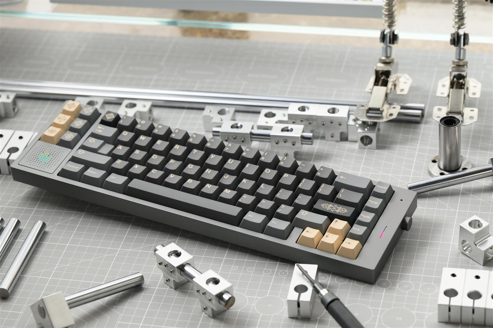
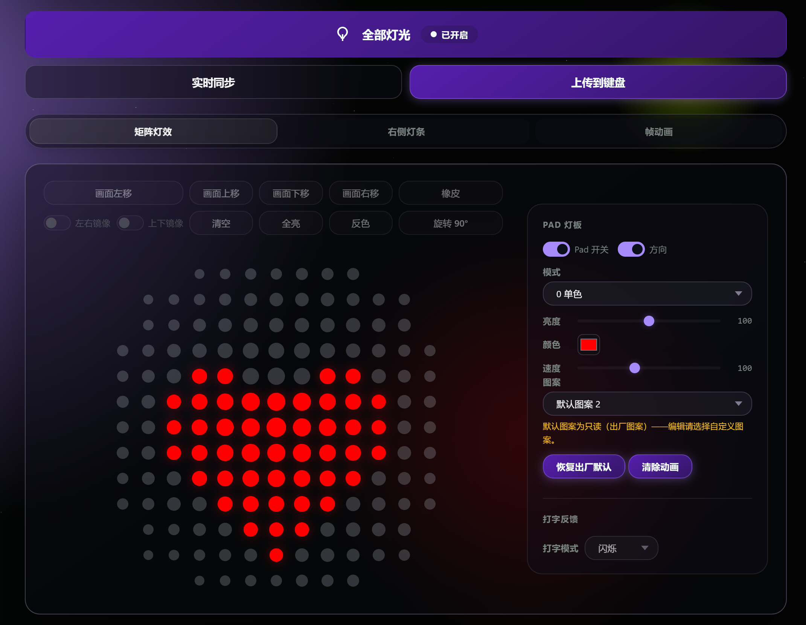

# 🎹 SONIC-170 v2 — 键盘灯光编辑工具

> 🔧 本仓库为 **kindlestar** 为客制化键盘 **SONIC-170 v2** 定制的 **PCBA 及配套网页工具**。
> 🙏 特别感谢 **阿姆骡** 同学的灵感启发及早期测试。

**🌐 English: [English](README.md)**

本仓库包含配置与重刷 SONIC-170 v2 键盘所需的全部内容：

| 📄 文件 | ℹ️ 说明 |
|---|---|
| `sonic170v2-rgb-control.html` | 网页编辑器（单文件、零依赖、WebHID/WebUSB、可离线使用） |
| `SONIC170_hotswap_v4.8.1.bin` | 固件——热插拔版 |
| `SONIC170_solder_v4.8.1.bin` | 固件——焊接版 |
| `sonic170_via_hotswap.json` | VIA 定义——热插拔版 |
| `sonic170_via_solder.json` | VIA 定义——焊接版 |

## ✨ 功能特性

- 🎨 **每图案独立配置** — 8 个图案槽各自保存 灯效/颜色/亮度/速度；切换图案即加载各自观感，重启不丢失
- 🧩 **13×13 矩阵图案编辑器** — 8 个图案槽（3 出厂 + 5 自定义）
- 🎞️ **帧动画** — 2 个动画槽，每槽最多 60 帧，可绑定到图案播放
- 💡 **侧边灯条 & CapsLock 灯**独立控制
- ⌨️ **打字反馈（Flicker）**模式
- 🔥 **内置 DFU 烧录器**（WebUSB、STM32 DfuSe 协议）— 无需驱动和外部工具，浏览器内直接烧录固件，含"清除设置与动画"修复选项
- 🚀 **内置 GitHub 更新检查** — 一键拉取本仓库最新固件与 VIA JSON
- 🌐 中英双语界面

## 🚀 快速开始

1. 📂 用 **Chrome 或 Edge** 打开 `sonic170v2-rgb-control.html`（双击文件即可，完全离线可用）。
2. 🔌 点击**连接**，选择键盘。
3. 🎚️ 编辑灯效、图案或动画 — 所有修改即时生效。
4. ⚡ 烧录固件：拔下 USB，按住 **Esc** 重新插入 → **烧录固件（DFU）** → 连接 "STM32 BOOTLOADER" 设备 → 选择 `.bin` 文件。

> 💡 WebHID / WebUSB 需要 Chromium 内核浏览器；工具支持本地文件、localhost 或 https 环境。

## 📦 发布

最新固件与 VIA 定义以 [GitHub Releases](https://github.com/709208969/sonic170-v2/releases) 形式发布；工具内"检查 GitHub 更新"按钮可一键获取（仓库：`709208969/sonic170-v2`）。

## 📜 开源协议

[MIT](LICENSE) © 2026 kindlestar (kevinxu)
